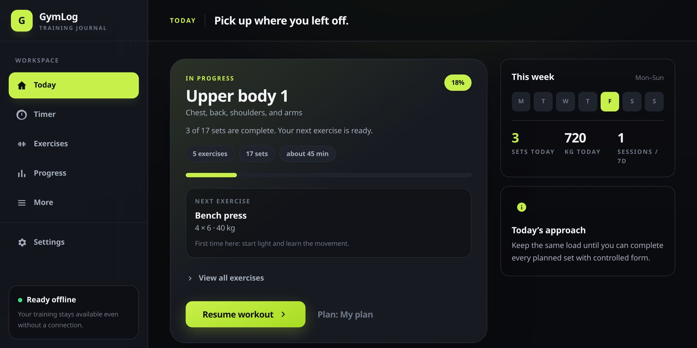
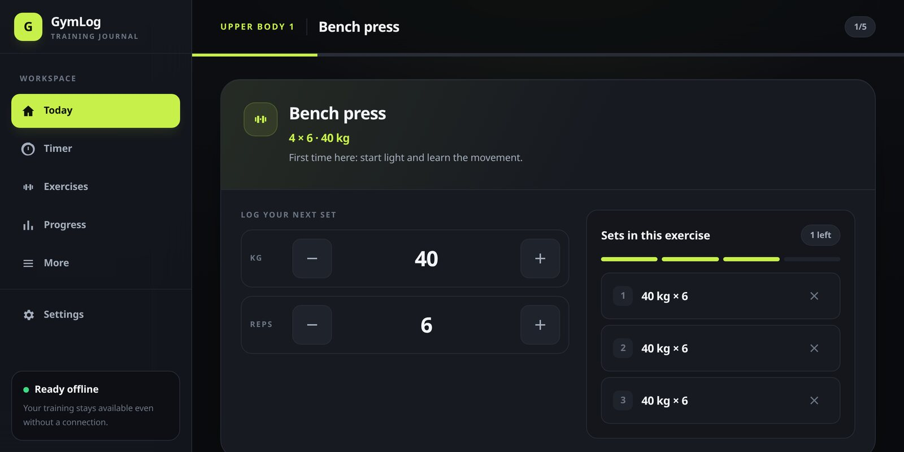
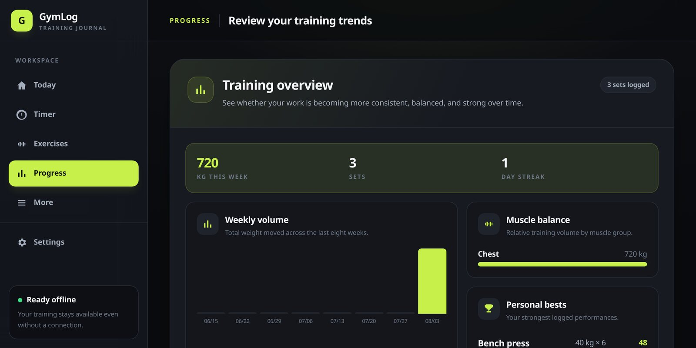

# GymLog

**An offline-first training journal that makes logging a set fast and keeps the
workout moving.**

[](https://github.com/aledtr77/gymlog/actions/workflows/ci.yml)
[](#quality-and-testing)
[](LICENSE)
[](https://gymlog.aledtr-77.workers.dev/)

[Open GymLog](https://gymlog.aledtr-77.workers.dev/) ·
[Report a bug](https://github.com/aledtr77/gymlog/issues) ·
[View the source](https://github.com/aledtr77/gymlog)



## What GymLog is

GymLog is a functional, installable progressive web app for planning workouts,
recording completed sets and understanding training progress. It works without an
account and remains useful without a permanent connection: workout data is stored on
the device, while the application shell is cached for offline startup.

The current release is a polished public prototype rather than a cloud-backed fitness
platform. It is suitable as a personal training journal and as a practical reference
for building a local-first browser application with real persistence, migrations and
recovery behaviour.

## Product highlights

- Guided setup based on experience and realistic weekly availability
- Full-body, upper/lower and push/pull/legs starting programmes
- A focused workout screen with suggested loads, repetitions and warm-up ramps
- Fast set logging, configurable rest timers and wake-lock support
- Searchable exercise library with favourites, equipment and movement guidance
- Workout history, personal records, estimated 1RM and weekly volume
- Muscle distribution, training cadence and body-weight tracking
- BMI, BMR, TDEE, macro, calorie and plate calculators
- Light, dark and system themes across mobile and desktop layouts
- Installable PWA shell with offline startup
- Versioned local persistence and portable JSON backup/restore

## The two screens that matter

Logging a set is two steppers and one button, because the screen is used out of
breath. The completed sets stack up beside it and the rest timer starts on its own.



Progress is what the log is for: volume moved, balance across muscle groups, and
personal bests, all derived from completed working sets.



## Typical flow

1. Choose an experience level and the number of days available each week.
2. Review the proposed programme before adopting it.
3. Open the next workout and adjust any starting loads.
4. Log each completed set and use the automatic recovery timer.
5. Review history, records, volume and cadence as training accumulates.
6. Export a JSON backup periodically to keep a portable copy of the data.

## Progression model

GymLog makes conservative suggestions from completed working sets. It can increase a
load after all targets are reached, hold it when repetitions or sets are missing, and
suggest a deload after repeated stalls. Warm-up and incomplete sets do not inflate the
decision. Plate-based exercises are rounded to loadable increments rather than to an
invented precision.

These suggestions are deliberately transparent and deterministic. They are general
training guidance, not medical advice or a replacement for a qualified coach.

## Local-first data model

There is no account system, application API or hosted user database in version 1.0.0.
Normal application use happens in the browser:

- IndexedDB stores sets, sessions, routines, favourites, body measurements, goals and
  optional progress photos.
- LocalStorage holds a small, separately versioned preferences document.
- Writes become visible only after the corresponding IndexedDB transaction commits.
- The browser is asked for persistent storage when that API is available.
- If IndexedDB cannot open, GymLog falls back to volatile memory and shows an explicit
  warning that new data will disappear when the page closes.

The persistence boundary lives under `src/services/`. An inert sync adapter provides a
defined seam for a future backend without uploading any workout data today.

## Migrations, backup and recovery

The current IndexedDB schema is version 4. Its upgrade path preserves older stores as
a safety net while importing useful records from previous data shapes. Preferences and
backup files have independent versions, so application schema changes do not silently
invalidate a user's export.

From **Settings → Data**, a user can:

- export or copy all user-owned data as versioned JSON;
- merge a compatible GymLog backup into existing records;
- replace local records from a compatible backup;
- delete all locally stored data.

Imports are validated before writing. Multi-store restore operations are atomic, and a
safety backup must be saved before an import can proceed. The transient sync outbox is
excluded because it is transport state rather than user-owned training data.

Clearing browser site data can still remove the database. Storage belongs to the site
origin, so the `workers.dev` deployment and any future custom domain have separate
browser databases. Export important records regularly.

## Privacy

GymLog records body measurements, progress photos and training history, which is
personal information in the ordinary sense and health data under the GDPR. The design
answer is that none of it is ever collected: there is no account, no application
backend and no request that carries user data off the device.

- Everything a user logs is written to IndexedDB and LocalStorage on their own device.
- No analytics, telemetry, advertising, error reporting or third-party script is
  loaded. The application makes no outbound request beyond fetching its own assets.
- No cookies are set. The browser storage that is used is strictly necessary for the
  application to function, so no consent banner is required.
- Users can export everything as JSON and permanently delete everything, both from
  **Settings → Data**, without asking anyone.
- Serving the application leaves ordinary web server access records, including IP
  addresses, with the hosting provider. GymLog neither adds to them nor reads them.

The same statement is a screen of the application, reachable as **Privacy** in the
desktop navigation rail and from **Settings** on a phone, rather than a link buried
inside another page.

This position depends on the architecture, not on good intentions, so it stops holding
the moment the architecture changes. Wiring a real backend into `src/services/sync.js`,
adding analytics or shipping through an app store each require a published privacy
policy, a lawful basis for processing health data and a defined deletion path. Those
obligations are part of the cost of the accounts phase described under
[Scope and limitations](#scope-and-limitations).

## Architecture

GymLog intentionally has no runtime framework dependency.

```text
src/
├── core/       domain rules, metrics, progression, routing and state
├── data/       exercises, programmes and coaching content
├── features/   lazily loaded application screens
├── platform/   browser capability adapters
├── services/   IndexedDB, preferences, migrations, backup and timer
├── ui/         DOM helpers, navigation, icons and shared components
└── main.js     application boot and route registration

public/
├── icons/      install and maskable application icons
├── manifest.webmanifest
└── sw.js       offline shell and asset caching
```

The interface uses semantic DOM nodes instead of injecting user content through
`innerHTML`. A small hash router lazy-loads each feature, while an event bus keeps
screens independent from storage and navigation. The service worker uses network-first
navigation and cache-first content-hashed assets.

## Technology

- JavaScript ES modules
- Semantic HTML and browser APIs
- Tailwind CSS and PostCSS
- Vite
- IndexedDB and LocalStorage
- Service Worker and Web App Manifest
- Node.js built-in test runner with `fake-indexeddb`
- Cloudflare Workers Static Assets

## Quality and testing

The automated suite currently contains **121 tests** covering:

- progression, deloads, warm-ups and loadable plate increments;
- sessions, routines, workout history and derived metrics;
- personal records, weekly volume and training cadence;
- preference validation and database schema upgrades;
- legacy imports, backup validation, atomic restore and rollback;
- navigation state and local-data deletion.

Run the complete checks locally — the same four a push to `main` has to pass:

```bash
npm install
npm run lint
npm test
npm run badge:check
npm run build
```

## Development

Requirements: a current Node.js release and npm.

```bash
git clone https://github.com/aledtr77/gymlog.git
cd gymlog
npm install
npm run dev
```

Additional commands:

```bash
npm run test      # complete automated test suite
npm run lint      # ESLint over src/, the service worker, tests and config
npm run badge     # rewrite the README test count to match the suite
npm run build     # production bundle in dist/
npm run preview   # preview the production build
npm run deploy    # build and deploy through Wrangler
```

The service worker is disabled in development so a previous production cache cannot
interfere with active UI work.

## Deployment

The public prototype is served from Cloudflare Workers Static Assets:

**https://gymlog.aledtr-77.workers.dev/**

`wrangler.jsonc` publishes the generated `dist/` directory and applies SPA fallback
handling. The deployment has no backend Worker script and no Cloudflare database.
Static hosting does not change the persistence model: workout records are not uploaded
by GymLog and remain in the visitor's browser.

## Scope and limitations

- No accounts, cloud backup or cross-device synchronisation
- No server-side recovery after browser data is deleted
- No native Android package or Play Store distribution
- No guarantee that every browser grants persistent storage, notifications or wake lock
- No medical diagnosis, injury guidance or personalised professional coaching

A future product phase could add accounts and native distribution, but only after
defining authentication, encrypted transport, conflict resolution, data deletion,
privacy obligations and operating costs. Those systems are intentionally not simulated
in the prototype.

## How this was built

I defined the product scope, user flows, feature priorities, privacy requirements and
acceptance criteria.
AI supported much of the implementation and documentation; I directed iteration,
reviewed the resulting changes, ran the verification workflow and made the release
decisions.

This repository documents what the prototype currently does, not a claim that I wrote
every line unaided. Generated suggestions are treated as code to inspect, test and
maintain rather than as proof of correctness.

## License

GymLog is released under the [MIT License](LICENSE). You may use, modify and distribute
the software under its terms. The software is provided without warranty.

Copyright © 2026 Alessandro Di Terlizzi.
